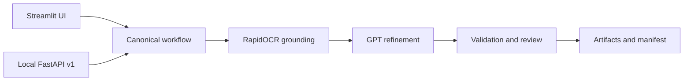

<!-- generated-by: gsd-doc-writer -->
# Agentic Document Extractor

A local Streamlit application for source-grounded document extraction with a mandatory RapidOCR first pass and OpenAI `gpt-5.6-luna` refinement.

The application accepts PDFs and common images, preserves OCR evidence and coordinates, and supports an auditable workflow from parsing through structured extraction and review. It is intended for local users and local API clients; it does not provide public hosting, authentication, or multi-tenant isolation.

## Key features

- Processes PDF, PNG, JPEG, and TIFF uploads up to 50 MiB and 200 pages.
- Supports inclusive PDF page ranges and single-page image processing.
- Requires RapidOCR and GPT for every successful extraction; there is no single-engine fallback.
- Uses `gpt-5.6-luna` with `reasoning_effort="medium"` for every OpenAI request.
- Offers Balanced and High Accuracy review modes.
- Produces grounded Markdown, canonical Parse JSON, an annotated PDF, semantic HTML, and a ZIP manifest bundle.
- Runs classification, sectioning, multi-document splitting, schema extraction, deterministic validation, and review routing.
- Accepts JSON Schema, guided field definitions, or Markdown field descriptions.
- Reports page-quality heuristics, workflow progress, token usage, and GPT cost.
- Exposes an optional typed, versioned FastAPI interface over the same pipeline.

## Technology stack

| Area | Technology |
| --- | --- |
| Runtime and packaging | Python 3.13, `uv`, Hatchling |
| User interface | Streamlit 1.62 or newer |
| Local OCR | RapidOCR, ONNX, ONNX Runtime GPU with CPU fallback |
| Semantic refinement | OpenAI Responses API, `gpt-5.6-luna` |
| PDF and image handling | pypdf, pypdfium2, Pillow, NumPy |
| Data contracts and validation | Pydantic, JSON Schema |
| Local HTTP API | FastAPI, Uvicorn |
| Quality gates | pytest, pytest-cov, Ruff, ty |

Exact constraints and the pinned RapidOCR revision are defined in [`pyproject.toml`](pyproject.toml) and [`uv.lock`](uv.lock).

## Installation

Prerequisites:

- Windows or Linux (the locked `onnxruntime-gpu` dependency does not provide a
  macOS wheel)
- [`uv`](https://docs.astral.sh/uv/)
- An OpenAI API key with access to `gpt-5.6-luna`
- Optional NVIDIA GPU; RapidOCR falls back to CPU when CUDA is unavailable

Clone the [GitHub repository](https://github.com/pypi-ahmad/OpenAI-X-RapidOCR-Agentic-Document_extraction):

```powershell
git clone https://github.com/pypi-ahmad/OpenAI-X-RapidOCR-Agentic-Document_extraction.git
cd OpenAI-X-RapidOCR-Agentic-Document_extraction
```

Synchronize the project-root environment, including development tools:

```powershell
uv sync --all-groups
```

Set the OpenAI key in the process environment. Never place its value in source files:

```powershell
$env:OPENAI_API_KEY = "<your key>"
```

`OPENAI_BASE_URL` is optional and should normally remain unset. See [`docs/CONFIGURATION.md`](docs/CONFIGURATION.md) for details.

## Quick start

1. Start Streamlit on the configured local port:

   ```powershell
   uv run streamlit run app.py --server.port 8841
   ```

2. Open [http://127.0.0.1:8841](http://127.0.0.1:8841).

3. Upload a supported document, select the pages and processing mode, define any optional workflow inputs, then choose **Extract document**.

On Windows, run [`run_app.cmd`](run_app.cmd) instead. The launcher displays logs in the foreground, identifies the PIDs listening on TCP port `8841`, revalidates each listener, and force-stops only verified listeners on that port before startup. It keeps the console open after an error or normal exit.

The installed console script is another equivalent entry point:

```powershell
uv run agentic-extractor
```

## How extraction works

Both engines are mandatory and execute in this order:

1. The application validates OpenAI model access and initializes RapidOCR.
2. The selected source pages are rendered and analyzed locally.
3. RapidOCR extracts text, recognition scores, polygons, and engine metadata.
4. Geometry-based parsing reconstructs reading order and candidate layout.
5. GPT validates and refines text and structure against grounded OCR evidence.
6. Optional Classify, Section, Split, and Extract workflows send the refined Markdown plus a
   compact grounding index to GPT; they do not resend source page images.
7. Deterministic validation either accepts the output, requests review, or fails.
8. Artifacts are generated only from the selected pages and canonical result.

Missing or invalid OpenAI configuration blocks processing before OCR starts. RapidOCR initialization failure also blocks processing with an actionable setup message. GPT cannot replace missing OCR evidence, and refinements never overwrite raw OCR blocks.

### Processing modes

| Mode | RapidOCR scope | GPT context and visual review |
| --- | --- | --- |
| **Balanced** | Every selected page | Compact grounded evidence plus every page image for checkbox discovery; fuller OCR/layout context only for uncertain or complex pages and regions |
| **High Accuracy** | Every selected page | Page image and full relevant OCR evidence for every selected page |

Both modes invoke the same required model at medium reasoning effort. Every page image is now
included for checkbox discovery; the modes differ in how much OCR and layout context GPT reviews.

High Accuracy also flags every RapidOCR block with recognition confidence strictly below `0.85`
for an explicit outcome in the existing GPT page-refinement request; it does not make an extra GPT
call. A grounded, accepted confirmation or correction resolves the flag. A missing, rejected, or
abstained outcome leaves the source block intact and makes the workflow `REVIEW_REQUIRED`.
Balanced mode does not enforce this per-block outcome coverage.

## Agentic workflow

```text
VALIDATED -> NORMALIZED -> PARSED -> CLASSIFIED -> SECTIONED -> SPLIT
-> EXTRACTED -> VALIDATED -> ACCEPTED | REVIEW_REQUIRED | FAILED
```

- **Parse** creates Markdown, ordered blocks, chunks, confidence, coordinates, metadata, warnings, failed-page records, timings, and engine provenance.
- **Classify** assigns only user-allowlisted page or document classes and retains supporting evidence.
- **Section** builds a hierarchical outline linked to pages and chunks.
- **Split** detects logical document boundaries and accepts explicit overrides.
- **Extract** produces evidence-bearing fields constrained by the selected schema.
- **Validate** checks schema rules and review policy before acceptance.

Document text is treated as untrusted data. It cannot change application policy, tools, routing, schemas, or permissions.

## Structured extraction schemas

The sidebar supports three inputs that normalize into the same internal schema:

1. **JSON Schema** for complete control over types, required fields, formats, patterns, numeric ranges, and schema-specific confidence thresholds.
2. **Guided fields** for defining names, descriptions, types, and requirements.
3. **Markdown fields** using `## field_name` headings and descriptions:

   ```markdown
   ## invoice_number
   Unique invoice identifier.

   ## invoice_date
   Issue date in YYYY-MM-DD format.
   ```

Field names must be unique. Extracted fields retain original and normalized values, source text, page and chunk IDs, coordinates when available, both-engine provenance, confidence, validation status, and review or abstention reason.

### Checkbox handling

GPT visually discovers square checkboxes on every selected page while RapidOCR supplies nearby
label text and geometry. High-confidence, grounded `CHECKED` and `UNCHECKED` controls may be
accepted automatically. Ambiguous states, weak label grounding, poor page quality, overlapping
controls, or rule conflicts receive one crop-based GPT verification and then require human review
when unresolved. Human decisions are stored as corrections without replacing OCR or GPT evidence.

Checkbox output is best-effort automation, not a 100% accuracy guarantee. Radio buttons and
signatures are outside the checkbox detector's scope.

Validation covers required fields, data types, date formats, identifier patterns, numeric ranges, configurable sums and totals, and cross-field relationships. Unsupported or uncertain values are abstained or marked `REVIEW_REQUIRED`; they are never represented as verified.

## Outputs and artifacts

Each successful run exposes:

- rendered and raw Markdown
- `document.md`
- `parse-result.json` with the canonical evidence-bearing Parse contract
- `annotated.pdf` showing OCR and layout regions from real geometry
- `document.html`, standalone semantic HTML rendered from refined Markdown with page and grounding context
- `bundle.zip` containing all artifacts, checkbox evidence crops, and `manifest.json`

The HTML view renders refined Markdown without embedding source-page images. It preserves selected-page boundaries and includes expandable block IDs, coordinates, confidence, and checkbox grounding. The manifest records selected pages, hashes, engine and model metadata, workflow decisions, refinements, usage, cost assumptions, warnings, and failures.

All OpenAI-facing policy, task, visual-label, page-context, and block-context prompts are Markdown
resources under `src/agentic_extractor/prompts/`. Their filenames are unversioned; internal prompt
metadata, usage records, and manifests retain the prompt version and SHA-256 digest.

## Quality, usage, and cost diagnostics

Before extraction, per-page diagnostics report dimensions, estimated source or render DPI, skew, sharpness and blur, contrast, shadows, likely JPEG block artifacts, and possible cropped edges. These are routing and rescan heuristics, not calibrated accuracy scores.

The Usage & Cost panel reports API calls; input, cached-input, output, and total
tokens when returned; per-call details; labeled per-page estimates; and session
totals. Reasoning tokens are retained in usage records and exports when the API
reports them. RapidOCR API cost is reported as `$0.00`; electricity and hardware
costs are not estimated.

Configured rates per one million tokens are:

- uncached input: `$0.20`
- cached input: `$0.02`
- cache writes: `$0.25`
- output: `$1.20`

```text
cost = uncached_input / 1,000,000 * 0.20
     + cached_input / 1,000,000 * 0.02
     + cache_write_input / 1,000,000 * 0.25
     + output / 1,000,000 * 1.20
```

For a request above 272,000 input tokens, the entire request uses a `2x` input multiplier and `1.5x` output multiplier. When usage is unavailable, the UI labels the value as estimated or unavailable instead of fabricating a total.

## Local API

Start the optional API separately on local port `8842`:

```powershell
uv run uvicorn agentic_extractor.api:app --host 127.0.0.1 --port 8842
```

OpenAPI documentation is available at [http://127.0.0.1:8842/docs](http://127.0.0.1:8842/docs) while the server is running. No authentication or rate limiting is implemented because this surface is designed only for trusted local-machine use.

| Method | Endpoint | Purpose |
| --- | --- | --- |
| `POST` | `/api/v1/jobs/parse` | Submit base64 document content and run Parse |
| `GET` | `/api/v1/jobs/{job_id}` | Read job state, Parse output, warnings, and failures |
| `POST` | `/api/v1/jobs/{job_id}/extract` | Run versioned schema extraction from an existing Parse result |
| `GET` | `/api/v1/jobs/{job_id}/extraction` | Read grounded fields, corrections, and review items |
| `GET` | `/api/v1/jobs/{job_id}/artifacts` | List artifact size, SHA-256 digest, and download URL |
| `GET` | `/api/v1/jobs/{job_id}/artifacts/{artifact_name}` | Download an allowlisted artifact |

Example Parse submission in PowerShell:

```powershell
$body = @{
    file_name = "invoice.png"
    content_base64 = [Convert]::ToBase64String(
        [IO.File]::ReadAllBytes("invoice.png")
    )
    mode = "Balanced"
} | ConvertTo-Json

Invoke-RestMethod http://127.0.0.1:8842/api/v1/jobs/parse `
    -Method Post -ContentType "application/json" -Body $body
```

Jobs run synchronously, remain in process memory, and expire one hour after submission. Restarting the API loses all jobs. See [`docs/API.md`](docs/API.md) for complete request, response, state, and error documentation.

## Architecture

The Streamlit and FastAPI entry points converge on the same canonical workflow:



The implementation separates ingestion, OCR, parsing, refinement, workflows, models, artifacts, cost accounting, and UI state. For the full runtime sequence and evidence boundary, read [`docs/architecture.md`](docs/architecture.md).

## Project structure

```text
.
|-- .streamlit/config.toml      Streamlit server and theme configuration
|-- app.py                      Streamlit navigation entry point
|-- streamlit_app.py            Parse workspace
|-- app_pages/                  Classify, Section, Split, and Extract pages
|-- run_app.cmd                 Windows foreground launcher for port 8841
|-- src/agentic_extractor/      Canonical models, pipeline, workflows, API, and artifacts
|-- tests/                      Focused unit and integration tests
|-- docs/                       Architecture, API, setup, development, and domain guides
|-- knowledge/                  Reference research data
|-- pyproject.toml              Package metadata, dependencies, and tool configuration
`-- uv.lock                     Reproducible dependency lock
```

## Development and testing

Run all configured quality gates from the repository root:

```powershell
uv run ruff format --check .
uv run ruff check .
uv run ty check
uv run pytest
```

Pytest enforces strict marker registration and at least 80% package coverage. The default suite mocks OpenAI boundaries and does not make paid API calls. The end-to-end API coverage uses fake OCR and mocked OpenAI responses while exercising the real adapters, ZIP bundle, and manifest contracts.

An explicitly paid prompt smoke benchmark is available with valid OpenAI configuration:

```powershell
$env:RUN_LIVE_PROMPT_EVAL = "1"
uv run pytest tests/test_prompt_quality_live.py -m live -s
```

It checks curated grounding, abstention, and checkbox cases; it is not a real-world accuracy claim.

See [`docs/DEVELOPMENT.md`](docs/DEVELOPMENT.md) for commands and code style, and [`docs/TESTING.md`](docs/TESTING.md) for test organization and focused runs.

## Limitations

- Both RapidOCR and valid OpenAI model access are required; offline-only and OCR-only successful workflows are intentionally unsupported.
- The local API has no authentication, rate limiting, durable storage, worker queue, streaming upload, or multi-instance coordination.
- Jobs and uploaded content are held in process memory and expire after one hour.
- Base64 API uploads add encoding overhead; the Streamlit uploader is preferable for interactive local use.
- Balanced routing and image-quality diagnostics use explicit heuristics rather than calibrated accuracy or performance guarantees.
- Automatic rotation and deskew are not applied without reliable orientation evidence.
- TIFF behavior depends on formats supported reliably by Pillow.

## Documentation

- [Getting started](docs/GETTING-STARTED.md)
- [Configuration](docs/CONFIGURATION.md)
- [Architecture](docs/architecture.md)
- [Local API](docs/API.md)
- [Development](docs/DEVELOPMENT.md)
- [Testing](docs/TESTING.md)
- [Domain model](docs/domain-model.md)
- [Glossary](docs/glossary.md)
- [ADR 0001: mandatory dual-engine pipeline](docs/adr/0001-mandatory-dual-engine-pipeline.md)
- [ADR 0002: evidence-preserving refinements](docs/adr/0002-preserve-evidence-and-audit-refinements.md)

## License

Licensed under the [MIT License](LICENSE).
