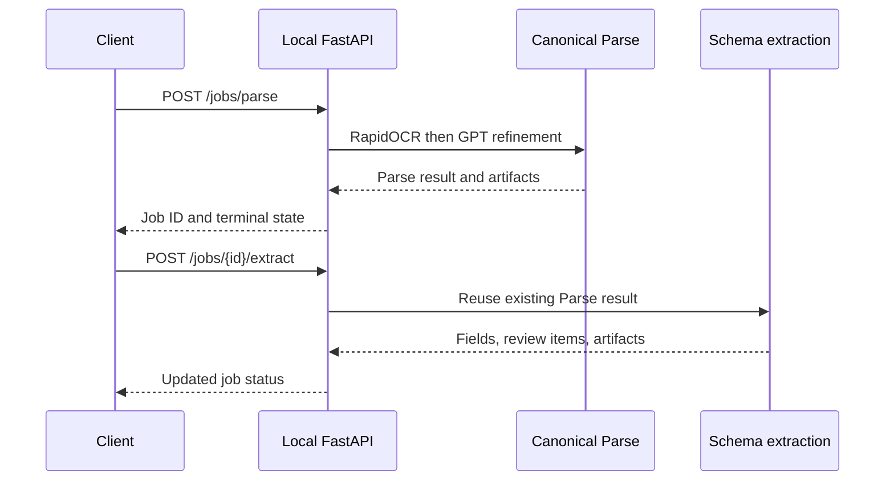

<!-- generated-by: gsd-doc-writer -->
# Local API reference

The FastAPI interface provides typed, versioned access to the same canonical
RapidOCR and GPT workflow used by Streamlit. It is a synchronous, process-local
surface for trusted clients on the same machine.

## Start the API

From the repository root, synchronize dependencies and provide the required
OpenAI configuration described in [Configuration](CONFIGURATION.md). Then run:

```powershell
uv run uvicorn agentic_extractor.api:app --host 127.0.0.1 --port 8842
```

While the server is running:

- Swagger UI: [http://127.0.0.1:8842/docs](http://127.0.0.1:8842/docs)
- OpenAPI JSON: [http://127.0.0.1:8842/openapi.json](http://127.0.0.1:8842/openapi.json)
- API version: `1.0.0`
- Route prefix: `/api/v1`

The Streamlit interface remains on port `8841`; the API is a separately started
local process.

## Authentication and rate limits

The API has no authentication or rate limiting. Do not bind it to a public or
untrusted network. Job IDs are random URL-safe identifiers, but possession of a
job ID is not an authentication mechanism.

## Processing model



The sequence shows that schema extraction reuses the canonical Parse result and
does not rerun RapidOCR.

Requests execute synchronously inside the HTTP handler. Although a submitted
job is initially represented as `PROCESSING`, the `POST` response is returned
after processing reaches `ACCEPTED`, `REVIEW_REQUIRED`, or `FAILED`.

## Endpoints overview

| Method | Path | Description | Auth required |
| --- | --- | --- | --- |
| `POST` | `/api/v1/jobs/parse` | Submit and parse a base64-encoded document | No |
| `GET` | `/api/v1/jobs/{job_id}` | Read job status and canonical Parse output | No |
| `POST` | `/api/v1/jobs/{job_id}/extract` | Extract a versioned schema from the stored Parse result | No |
| `GET` | `/api/v1/jobs/{job_id}/extraction` | Read grounded fields, corrections, and review items | No |
| `GET` | `/api/v1/jobs/{job_id}/artifacts` | List generated artifact metadata | No |
| `GET` | `/api/v1/jobs/{job_id}/artifacts/{artifact_name}` | Download an allowlisted artifact | No |

## Submit a Parse job

`POST /api/v1/jobs/parse`

### Request

| Field | Type | Required | Rules |
| --- | --- | --- | --- |
| `file_name` | string | Yes | 1–255 characters; retained as document metadata |
| `content_base64` | string | Yes | Valid base64; decoded content must be nonempty and at most 50 MiB |
| `mode` | string | No | `Balanced` by default, or `High Accuracy`; High Accuracy requires a grounded accepted outcome for every OCR block with confidence below `0.85` |
| `selected_pages` | integer array or null | No | Positive, one-based page numbers; duplicates are removed and values sorted |
| `enable_preprocessing` | boolean | No | Defaults to `false` |

The content must be a supported readable PDF, PNG, JPEG, or TIFF. Format checks
use source signatures rather than trusting only the filename extension.

```json
{
  "file_name": "invoice.png",
  "content_base64": "<base64-document-content>",
  "mode": "Balanced",
  "selected_pages": [1],
  "enable_preprocessing": false
}
```

### Response

Successful submission returns HTTP `201` and a `JobCreated` body:

```json
{
  "job_id": "<opaque-job-id>",
  "state": "ACCEPTED",
  "status_url": "/api/v1/jobs/<opaque-job-id>"
}
```

`state` can instead be `REVIEW_REQUIRED` or `FAILED`. A setup failure detected
before job creation returns HTTP `503`, so no job ID is issued.

## Get job status

`GET /api/v1/jobs/{job_id}`

HTTP `200` returns a `JobStatus` object:

```json
{
  "job_id": "<opaque-job-id>",
  "state": "REVIEW_REQUIRED",
  "warnings": [],
  "failed_pages": [],
  "review_required": ["Review extracted field invoice_number"],
  "result": {
    "contract_version": 3,
    "selected_pages": [1],
    "markdown": "<!-- page: 1 -->\n\nInvoice 42",
    "warnings": [],
    "failed_pages": []
  },
  "artifacts": {
    "document.md": "/api/v1/jobs/<opaque-job-id>/artifacts/document.md"
  },
  "error": null
}
```

The `result` object is the canonical Parse JSON and may include fields beyond
the minimum typed properties shown above. Raw `content_base64` is not returned.
For the evidence model, see the [Domain model](domain-model.md).

For a High Accuracy job, per-block review coverage is exposed at
`result.document_metadata.low_confidence_block_reviews`. Each entry contains
`block_id`, `page`, `ocr_score`, and a status of `accepted`, `rejected`,
`abstained`, or `missing`, plus a reason when available. Only `accepted`
indicates a grounded confirmation or correction. Any other status adds a
message to the top-level `review_required` array and makes the workflow state
`REVIEW_REQUIRED` unless a failure takes precedence. Balanced jobs do not add
`low_confidence_block_reviews` metadata or enforce this per-block coverage.

## Run schema extraction

`POST /api/v1/jobs/{job_id}/extract`

This endpoint requires a stored canonical Parse result. Eligibility is based on
that result being available, not on the previous workflow's terminal state. It
validates the JSON Schema and runs extraction from a deep copy of the result. It
does not rerun RapidOCR. GPT remains mandatory for extraction, and generated
artifacts are rebuilt with the updated workflow and audit data.

### Request

| Field | Type | Required | Rules |
| --- | --- | --- | --- |
| `schema_version` | string | Yes | 1–64 characters |
| `schema` | object | Yes | Valid JSON Schema; stored internally with `x-schema-version` |
| `business_rules` | object array | No | Defaults to an empty list |

```json
{
  "schema_version": "1",
  "schema": {
    "type": "object",
    "properties": {
      "invoice_id": {
        "type": "string",
        "description": "Unique invoice identifier"
      }
    },
    "required": ["invoice_id"]
  },
  "business_rules": []
}
```

HTTP `200` returns the updated `JobStatus`. Invalid request envelopes or JSON
Schemas return HTTP `422`; a missing Parse result returns HTTP `409`.

## Get structured extraction

`GET /api/v1/jobs/{job_id}/extraction`

HTTP `200` returns:

```json
{
  "job_id": "<opaque-job-id>",
  "state": "ACCEPTED",
  "schema_version": "1",
  "fields": [],
  "corrections": [],
  "review_required": [],
  "review_items": [],
  "checkboxes": [],
  "checkbox_corrections": []
}
```

Each `ValidatedField` can retain value and normalized value, source text, source
page, block and chunk IDs, bounding box or polygon, engine provenance,
confidence by engine, validation errors and outcome, and review or abstention
reason. Corrections remain a separate audit layer. A Parse-only job already has
a workflow result, so this endpoint can return HTTP `200` with empty extraction
fields. It returns HTTP `409` only when the job has no workflow result.

High Accuracy block-review records are not separate fields in this response.
Their unresolved messages appear in `review_required` and corresponding
structured `review_items`; retrieve the records themselves from job status or
`parse-result.json`.

`checkboxes` contains grounded GPT-visual checkbox observations with RapidOCR label evidence,
discovery and verification states, confidence, decision status, and review reason.
`checkbox_corrections` contains auditable local user decisions. Checkbox automation is
best-effort; unresolved controls remain `REVIEW_REQUIRED`.

## List and download artifacts

`GET /api/v1/jobs/{job_id}/artifacts` returns an `ArtifactList`. Each item
contains `name`, byte length, SHA-256 digest, and an opaque job-scoped download
URL.

Only these exact artifact names are downloadable:

| Name | Media type | Contents |
| --- | --- | --- |
| `document.md` | `text/markdown` | Refined, grounded Markdown |
| `parse-result.json` | `application/json` | Canonical Parse contract and audit data |
| `annotated.pdf` | `application/pdf` | Selected pages with OCR/layout geometry |
| `document.html` | `text/html` | Refined Markdown rendered with page and grounding context |
| `bundle.zip` | `application/zip` | Artifacts, checkbox crops under `checkboxes/`, and `manifest.json` |

The downloaded `parse-result.json` uses the same
`document_metadata.low_confidence_block_reviews` location as the job-status
`result`. In `bundle.zip`, `manifest.json` copies document metadata under
`source`, so the records are at `source.low_confidence_block_reviews`; workflow
state and review messages are under `agent_workflow`.

Download an item through
`GET /api/v1/jobs/{job_id}/artifacts/{artifact_name}`. The response includes a
`Content-Disposition: attachment` filename. Unknown or non-allowlisted names
return HTTP `404`; jobs without artifacts return HTTP `409`.

## Job states

| State | Meaning |
| --- | --- |
| `PROCESSING` | Work has started; primarily an internal transitional state because handlers are synchronous |
| `ACCEPTED` | Required stages and validation completed without unresolved review conditions |
| `REVIEW_REQUIRED` | Processing completed, but one or more evidence or validation conditions require review; in High Accuracy this includes any below-`0.85` OCR block whose GPT outcome is missing, rejected, or abstained |
| `FAILED` | Processing or extraction ended in a retained terminal error |

Jobs remain in a closure-local in-memory dictionary for 3,600 seconds after
submission. Expired jobs are removed during subsequent job lookups and return
`404`. Restarting the API immediately loses every job and uploaded document.

## Errors

Setup and application errors use this body shape:

```json
{
  "detail": {
    "code": "openai_unavailable",
    "message": "<actionable message>",
    "action": "Add valid OpenAI configuration and retry.",
    "retryable": true
  }
}
```

FastAPI/Pydantic request validation errors use the standard HTTP `422` detail
array instead.

| Status | Code or condition | Meaning |
| --- | --- | --- |
| `201` | Job created | Parse ran and a job record was created, including terminal failures after processing began |
| `200` | Successful read/update | Requested state or artifact metadata is available |
| `404` | `job_not_found` | Job ID is unknown or expired |
| `404` | `artifact_not_found` | Artifact name is not in the allowlist |
| `409` | `parse_unavailable` | Schema extraction was requested without a canonical Parse result |
| `409` | `extraction_unavailable` | The job has no workflow result |
| `409` | `artifacts_unavailable` | The job has no generated artifacts |
| `422` | Request validation | Base64, nonpositive selected pages, field constraints, or JSON Schema is invalid |
| `503` | `openai_unavailable` | OpenAI configuration is missing or cannot access the required model |
| `503` | `rapidocr_unavailable` | RapidOCR or ONNX Runtime could not initialize |

Caught processing and extraction exceptions are retained in `JobStatus.error`
with code `processing_failed` or `extraction_failed`, a message, suggested
action, and retryable flag. A deterministic workflow transition to `FAILED` may
instead leave `error` unset and retain its reasons in workflow data or warnings.
Positive page numbers beyond the document range follow this post-creation path:
the API returns HTTP `201` with a terminal `FAILED` job rather than envelope
validation HTTP `422`.

## PowerShell examples

### Submit and inspect a document

```powershell
$documentPath = "C:\path\to\invoice.png"
$body = @{
    file_name = [IO.Path]::GetFileName($documentPath)
    content_base64 = [Convert]::ToBase64String(
        [IO.File]::ReadAllBytes($documentPath)
    )
    mode = "Balanced"
} | ConvertTo-Json

$job = Invoke-RestMethod "http://127.0.0.1:8842/api/v1/jobs/parse" `
    -Method Post -ContentType "application/json" -Body $body

$status = Invoke-RestMethod "http://127.0.0.1:8842$($job.status_url)"
$status
```

### Extract a schema and download the bundle

```powershell
$schemaBody = @{
    schema_version = "1"
    schema = @{
        type = "object"
        properties = @{
            invoice_id = @{ type = "string" }
        }
        required = @("invoice_id")
    }
    business_rules = @()
} | ConvertTo-Json -Depth 8

Invoke-RestMethod `
    "http://127.0.0.1:8842/api/v1/jobs/$($job.job_id)/extract" `
    -Method Post -ContentType "application/json" -Body $schemaBody

Invoke-WebRequest `
    "http://127.0.0.1:8842/api/v1/jobs/$($job.job_id)/artifacts/bundle.zip" `
    -OutFile ".\bundle.zip"
```

Use placeholders or local paths in scripts; never embed `OPENAI_API_KEY` in a
request body or checked-in file.

## Local-only limitations

- Requests are synchronous; there is no worker queue or background job runner.
- Jobs, uploaded bytes, results, and artifacts exist only in process memory.
- There is no persistence, authentication, authorization, rate limiting,
  streaming upload, multi-instance coordination, or tenant isolation.
- Base64 increases request size compared with a binary multipart upload.
- Restart and one-hour expiry are destructive for job state.

For interactive use, start with the [project README](../README.md). See
[Architecture](architecture.md) for the shared pipeline and
[Configuration](CONFIGURATION.md) for required engine setup.
