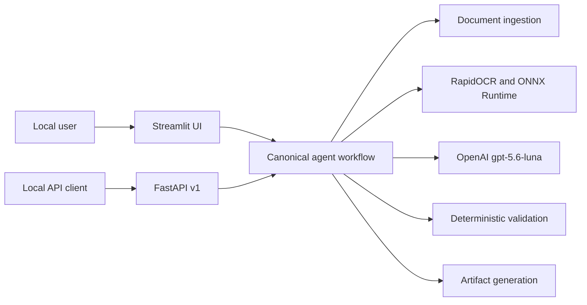
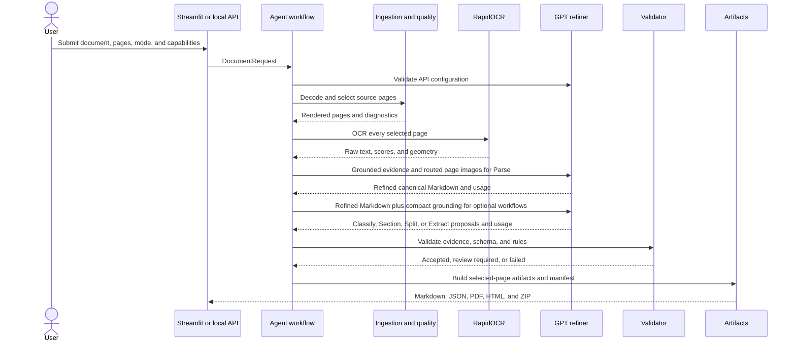
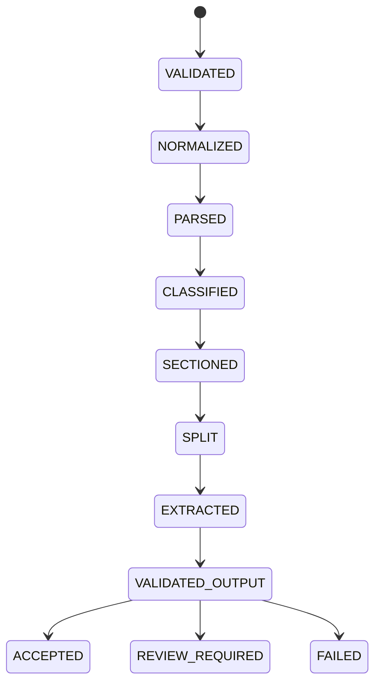

<!-- generated-by: gsd-doc-writer -->
# Architecture

## Purpose

This application extracts structured, source-grounded information from local
PDF and image uploads. A successful run always uses RapidOCR first and OpenAI
`gpt-5.6-luna` second. The Streamlit UI and local FastAPI surface call the same
canonical workflow; neither implements extraction independently.

## System context

The diagram shows both local entry points converging on one workflow.

The application is local-machine software. Streamlit is configured for
`127.0.0.1:8841`; the API is run separately with Uvicorn and its documented
loopback binding. API jobs and uploaded bytes remain in process memory until
their configured TTL expires. There is no user, tenant, or authentication
model.

## Runtime flow

The diagram shows the required engine order and where deterministic checks run.

OpenAI configuration is checked before local OCR begins. RapidOCR initialization
or all-page OCR failure raises a setup error. GPT failure raises a refinement
error. There is no successful single-engine fallback.

## Module map

| Module | Responsibility |
|---|---|
| `app.py` | Streamlit navigation and shared page configuration |
| `streamlit_app.py` | Parse controls, previews, artifacts, and session usage |
| `app_pages/` | Separate Classify, Section, Split, and Extract result/review pages |
| `src/agentic_extractor/ingest.py` | Signature-based PDF/image decoding, size limits, and page selection |
| `src/agentic_extractor/quality.py` | Heuristic page diagnostics, measured preprocessing, and batch backoff |
| `src/agentic_extractor/ocr.py` | RapidOCR initialization, page OCR, raw evidence, and engine provenance |
| `src/agentic_extractor/parse.py` | Reading order, layout signals, routing reasons, and Markdown reconstruction |
| `src/agentic_extractor/openai_refiner.py` | Bounded OpenAI requests, structured output, checkbox visual review, and usage capture |
| `src/agentic_extractor/prompt_resources.py` | Strict loading, rendering, versioning, and hashing of packaged Markdown prompts |
| `src/agentic_extractor/pipeline.py` | Dual-engine orchestration and evidence-gated refinement merge |
| `src/agentic_extractor/workflow.py` | ADE-style state flow, classification, sections, splits, extraction, and review |
| `src/agentic_extractor/capabilities.py` | Validation of GPT-derived classifications, sections, splits, and extraction evidence |
| `src/agentic_extractor/schema_input.py` | JSON Schema, guided fields, and Markdown field conversion |
| `src/agentic_extractor/artifacts.py` | Canonical Parse JSON, annotated PDF, semantic HTML, ZIP, and manifest |
| `src/agentic_extractor/export.py` | Portable ZIP export for the simpler `DocumentResult` boundary |
| `src/agentic_extractor/costs.py` | Token accounting and centralized rate assumptions |
| `src/agentic_extractor/api.py` | Versioned local HTTP façade over `run_agent_workflow` |
| `src/agentic_extractor/models.py` | Shared request, block, evidence, usage, and result models |
| `src/agentic_extractor/ui_state.py` | Streamlit lifecycle state and upload identity tracking |
| `src/agentic_extractor/config.py` | Local limits, model policy, pricing, and job lifetime defaults |

## Workflow states

The diagram mirrors the states recorded in `AgentWorkflowResult.events`.

`VALIDATED_OUTPUT` is a diagram label for the second `VALIDATED` event emitted
by the implementation. Each event records its action, provider, reason, elapsed
time, warnings, and GPT token/cost impact where applicable.

## Mode behavior

| Mode | RapidOCR | GPT text context | GPT images |
|---|---|---|---|
| Balanced | Every selected page | Compact grounded context; full context only for routed uncertainty or complexity | Every selected page for checkbox discovery |
| High Accuracy | Every selected page | Full relevant evidence; every OCR block below `0.85` is flagged as requiring a GPT outcome | Every selected page |

Both modes invoke `gpt-5.6-luna` with medium reasoning effort. The difference is
review scope, not engine participation. The low-confidence flag is included in
the same page-level Parse request; High Accuracy does not issue a separate API
call for each block. GPT must return exactly one grounded outcome for every
flagged block: confirm the original text, propose a supported correction, or
abstain. A grounded accepted confirmation or correction resolves the flag.
Missing, rejected, or abstained outcomes become `REVIEW_REQUIRED`. Balanced
continues to use the same routing and refinement behavior without enforcing
per-block outcome coverage.

Checkbox discovery is an intentional exception to the former Balanced image-routing optimization:
every selected page image is supplied so a checkbox invisible to OCR is not skipped. Risky controls
are verified once more using bounded crops. This improves coverage but remains best-effort and
increases Balanced-mode image cost.

## Evidence and refinement boundary

RapidOCR blocks are immutable source evidence. GPT returns proposals citing an
existing block ID or a normalized bounding box on an attached page. The merge
layer rejects unsupported evidence and records accepted corrections separately.
User corrections are also an append-only audit layer; they do not replace the
raw OCR block.

For High Accuracy, the merge records an `accepted`, `rejected`, `abstained`, or
`missing` review status for each block whose RapidOCR score is below `0.85`.
Accepted resolutions are applied only to a deep-copied derived page model used
to rebuild Markdown; the original page blocks and raw OCR evidence remain
unchanged.

The annotated PDF is generated from canonical block geometry. Semantic HTML is
generated from refined Markdown and includes the canonical grounding context.

## Public boundaries

- `run_agent_workflow` is the canonical full-document entry point. It validates
  OpenAI access, initializes RapidOCR, parses selected pages, performs required
  GPT refinement, adjudicates workflow results, and returns
  `LocalParseResult` with `AgentWorkflowResult`.
- `run_workflow_from_parse` applies GPT refinement and adjudication to an
  existing `LocalParseResult`. The API extraction endpoint uses this boundary
  so schema extraction does not rerun RapidOCR.
- `process_hybrid_document` exposes the required two-engine Parse path without
  ADE adjudication. `_process_local_document` is an internal building block and
  is not a successful extraction path by itself.
- `DocumentRequest` is the shared command model. `LocalParseResult` preserves
  page images, raw OCR output, geometry, diagnostics, routing, usage, attempts,
  and refinements; `AgentWorkflowResult` holds derived decisions and audit
  events. `DocumentResult` remains a smaller compatibility result used by the
  capability pipeline and its portable export helper.

## Local API

The API exposes `/api/v1` endpoints for submission, status, extraction,
structured results, artifact metadata, and allowlisted downloads. Request and
response bodies are Pydantic models and OpenAPI is available at `/docs` and
`/openapi.json`.

Jobs execute synchronously and remain in a closure-local dictionary until
their TTL expires. Job IDs are random URL-safe values. Documents are returned
only through an existing opaque job ID and an allowlisted artifact name; no
upload directory is exposed. API errors use typed codes and actionable setup
messages, while failed-page and review details remain available through job
status.

## Failure and review semantics

- Invalid files, page ranges, schemas, or request options fail validation.
- Missing RapidOCR or OpenAI setup prevents successful processing.
- A failed GPT request fails the extraction.
- Missing or invalid source evidence makes a proposal invalid or reviewable.
- Missing required fields produce abstentions and review items.
- In High Accuracy, every OCR block below `0.85` must have a grounded accepted
  outcome; missing, rejected, and abstained outcomes require human review.
- Failed pages, schema errors, and business-rule failures remain visible in the
  workflow and manifest.

## Design pressure points

1. `LocalParseResult` plus `AgentWorkflowResult` form the canonical full
   workflow contract, while `DocumentResult` supports the simpler capability
   pipeline. New entry points should choose deliberately and must not invent a
   third result shape.
2. The API is intentionally synchronous and process-local. Persistence or
   workers would change failure recovery and should require a separate ADR.
3. Pricing is configuration, not an invariant. Update
   `src/agentic_extractor/costs.py`, its tests,
   and documentation together when model pricing changes.
4. Quality scores are heuristics. They guide review and preprocessing but do
   not establish extraction accuracy.
5. CUDA selection first accepts a CUDA plugin device when ONNX Runtime exposes
   one, then falls back to the conventional `CUDAExecutionProvider` plus GPU
   device check. After the first OCR call, the detector session provider list is
   inspected; if CUDA is absent, engine provenance is changed to CPU.
