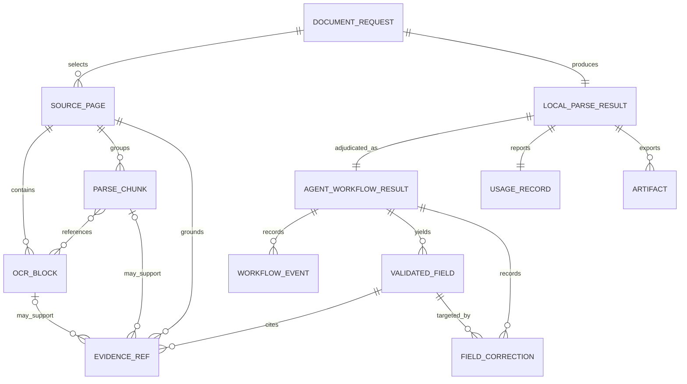

<!-- generated-by: gsd-doc-writer -->
# Domain model

## Core model

The diagram shows ownership and evidence relationships, not storage tables.

## Aggregates and invariants

### Document request

`DocumentRequest` is the processing command. It owns the source bytes, mode,
selected pages, enabled capabilities, classification allowlist, extraction
schema, split overrides, business rules, and preprocessing choice.

Invariants:

- `Classify` requires at least one allowed class.
- `Extract` requires a JSON Schema.
- Processing mode is either Balanced or High Accuracy.
- Page numbers are one-based and selected pages must exist in the source.

### Source page and OCR block

An ingested page retains its original source page number. A parsed `PageParse`
retains its pixel dimensions, source image, blocks, chunks, OCR timing, raw
engine output, derived layout signals, warnings, and status. A block has a
stable ID, page, text, type, optional raw RapidOCR score, optional source-pixel
polygon, and optional normalized `xyxy` bounding box. A `ParseChunk` groups
ordered source block IDs and carries their union bounding box and raw scores. Derived visual
chunks may have no OCR source blocks; they carry their own page-relative box,
`provenance="gpt-visual"`, and verification status. `PageParse.visual_audits` stores
their decision history, while optional `inspection_image_bytes` holds a higher-resolution raster.

Confidence is engine-specific raw evidence. It is nullable and is not treated
as calibrated across engines.

### Visual objects and document links

`VisualObject` in `rich_document.py` represents missed text, a figure/chart description,
or an equation. It has an application-assigned stable ID, page, positive-area normalized box,
content, reading order, and optional source block IDs. `CloudResult.visual_objects` retains
proposals separately from immutable RapidOCR evidence. Matching audit records are bound to
the complete proposal hash, so approval cannot be reused for changed content.

Pending objects publish `[VISUAL_CONTENT_REQUIRES_REVIEW]`, not proposed values.
`model_verified` requires a supported crop decision with matching transcription after
stripping surrounding whitespace. A human approve/correct decision produces
`human_approved`; rejection removes the object from canonical Markdown. Invalid source
references still require review. Human actions require a reason and preserve prior audits.
Descriptions remain explicitly labelled and cannot support exact-value extraction as chunk evidence.

`DocumentLink` references source and target chunk IDs with `continues`, `caption_of`, or
`parent_of`. Validation checks endpoints, duplicate edges and directed cycles; continuation
also requires forward page/reading order. Links remain model proposals and do not merge pages.

### Grounding references

An evidence reference links a proposal to a source page and may include one or
more of:

- an existing RapidOCR block, optionally with a quote contained in that block;
- an existing grounded Parse chunk, including verified visual text/equations; or
- a normalized visual bounding box on a page image actually sent to GPT.

Evidence cannot grant new permissions, change routing, or modify the requested
schema. Document text is always untrusted data.

### Local Parse result

`LocalParseResult` carries selected pages, raw page evidence, reconstructed
Markdown, engine provenance, warnings, failed pages, timings, quality
diagnostics, routing, cloud output, usage, and the workflow manifest. Artifact
generation consumes this contract.

### Validated field

A `ValidatedField` retains:

- proposed and normalized values;
- source text, page, block/chunk ID, bounding box, and polygon;
- RapidOCR and GPT provenance;
- confidence and status;
- validation errors and outcome;
- review or abstention reason; and
- validated evidence references.

Allowed statuses are `verified`, `uncertain`, `abstained`, and `invalid`.
Field verification requires declared schema membership, valid source
grounding, schema-compatible normalized data, and any configured field
confidence threshold. Whole-schema and business-rule checks are evaluated
after the verified values are assembled; those checks can make the workflow
`REVIEW_REQUIRED` without rewriting an individual field's evidence or status.

### Field correction

A user acceptance or correction records the field path, previous and new
values, reason, UTC timestamp, actor, and action. It is copied onto a new
workflow result; the original OCR and extraction proposal remain unchanged.

### Workflow result

`AgentWorkflowResult` is the auditable decision record. It owns events,
classifications, sections, splits, extracted fields, review items, errors,
schema version, and user corrections.

When adjudication returns a result, its terminal state is:

- `ACCEPTED` when all enabled checks pass;
- `REVIEW_REQUIRED` when evidence or validation is incomplete; or
- `FAILED` when adjudication records a fatal error, including absent mandatory
  GPT participation.

OpenAI preflight, RapidOCR initialization, all-page OCR failure, or an initial
GPT request failure raises an actionable exception before a successful workflow
result is returned. A partial failed-page set remains in the Parse result and
causes review rather than silently disappearing.

### Checkbox evidence

`CheckboxRecord` is a derived, evidence-bearing result. It stores the visible state, source page,
normalized control and label geometry, RapidOCR label block or chunk, GPT discovery and optional
verification decisions, confidence, provenance, review reason, and ZIP crop reference. Raw OCR and
GPT proposals remain unchanged; `CheckboxCorrection` records a user's later verified decision.

Only grounded `CHECKED` and `UNCHECKED` observations can be automatically accepted. Special or
ambiguous states, invalid geometry, poor page quality, weak label grounding, overlap, disagreement,
and checkbox business-rule failures require review. This is not a calibrated accuracy guarantee.

### Usage record

`UsageRecord` stores provider-reported token components, elapsed time, per-call
records, and calculated costs. Cost is exact when input, cached-input,
cache-write-input, and output token counts are reported. Missing cached-input
or cache-write-input usage produces an estimate; missing or invalid
input/output usage makes cost unavailable. Other optional token components may
remain `None` without changing that status, and usage is never fabricated.

The OpenAI boundary captures available usage before structured parsing can fail. Its
attempt ledger is thread-local; failed attempts are included in API job usage and UI
processing history. These records do not fabricate missing provider billing information.

## Schema inputs

All schema entry paths converge on a JSON Schema object:

| Input | Conversion |
|---|---|
| JSON Schema | Parse and validate a Draft 2020-12 schema |
| Guided fields | Build properties, required list, formats, patterns, and ranges |
| Markdown fields | Convert each unique `## field_name` heading and description to an optional string property |

Schema version is read from `x-schema-version` or `$id`; otherwise the workflow
reports `unversioned`.

## Business rules

The deterministic workflow currently supports:

- `equals` for an exact expected value;
- `sum_equals` for totals and line-item paths, with a configurable tolerance;
- `less_than_or_equal` for ordered numeric constraints;
- `checkbox_exactly_one`, `checkbox_min_selected`, and
  `checkbox_max_selected` for selected-control counts;
- `checkbox_mutually_exclusive` for incompatible selections; and
- `checkbox_none_exclusive` to prevent a none option from coexisting with
  another selected choice.

Unsupported rule operations produce review errors rather than being ignored.

## Split provenance

Each logical split retains its inclusive start/end pages and explicit list of
selected source pages. User-supplied boundary values identify the first page of
a new segment, must belong to the selected pages after the first selected page,
and require an audit reason. An incomplete or ungrounded GPT split proposal is
replaced with one safe segment and a review warning rather than dropping pages.

See [Architecture](ARCHITECTURE.md) for runtime ownership and public pipeline
boundaries, and [API](API.md) for the process-local job representations exposed
over HTTP.
